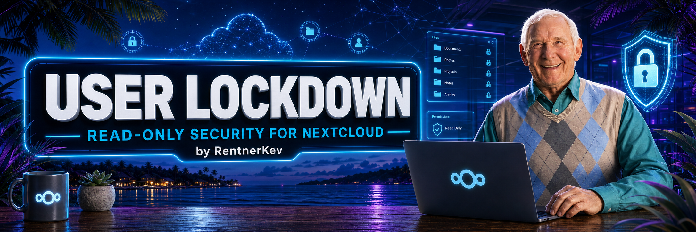
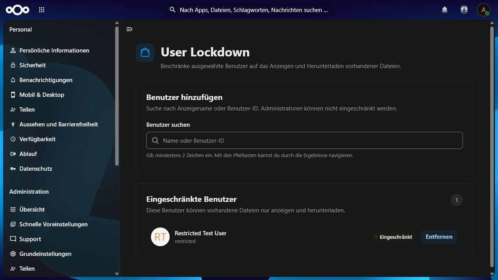
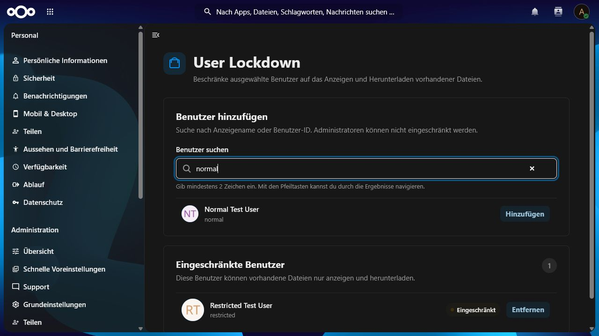
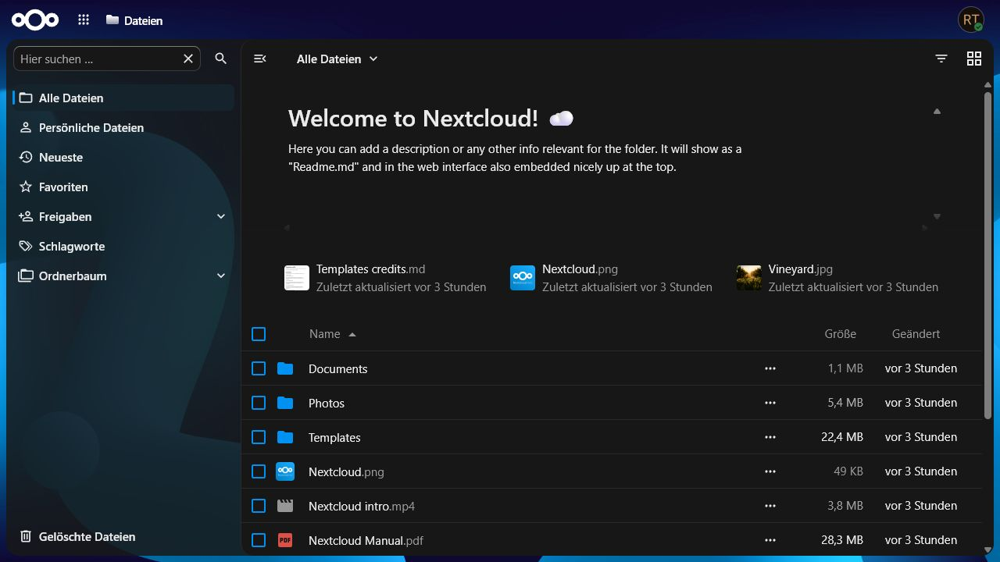
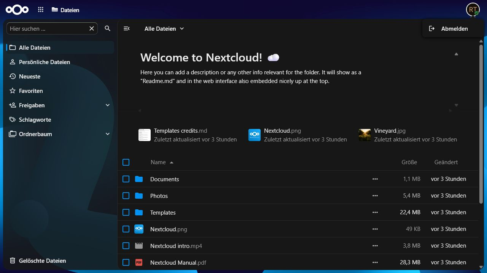

<p align="center">
  
</p>

<h1 align="center">User Lockdown</h1>

<p align="center">
  <strong>Server-enforced read-only access for selected Nextcloud users.</strong>
</p>

<p align="center">
  <a href="https://github.com/RentnerKev/UserLockdown/actions/workflows/ci.yml"></a>
  
  
  <a href="LICENSE"></a>
</p>

User Lockdown is a Nextcloud security app that places selected, non-admin users
into a deliberately narrow read-only mode. Restricted users can sign in, sign
out, browse existing files, preview them, and download them. Administrators keep
full control and manage the restricted-user list centrally.

Version 1.0.0 supports Nextcloud 32–34 and PHP 8.2–8.5.

## See it in action

<table>
  <tr>
    <td width="50%" valign="top">
      
      <br>
      <strong>Central administration</strong><br>
      <sub>Review restricted users and remove restrictions from one focused settings page.</sub>
    </td>
    <td width="50%" valign="top">
      
      <br>
      <strong>Fast user search</strong><br>
      <sub>Find non-admin accounts by display name or user ID and restrict them immediately.</sub>
    </td>
  </tr>
  <tr>
    <td width="50%" valign="top">
      
      <br>
      <strong>Clean restricted Files view</strong><br>
      <sub>Viewing, previewing, and downloading remain available without intrusive warning panels.</sub>
    </td>
    <td width="50%" valign="top">
      
      <br>
      <strong>Minimal account menu</strong><br>
      <sub>Restricted sessions expose only the action the user still needs: signing out.</sub>
    </td>
  </tr>
</table>

## Highlights

- Central restriction management in the Nextcloud administration settings.
- Read, preview, and download access without upload, edit, share, rename, or
  delete permissions.
- Server-side enforcement across WebDAV, AppFramework controllers, shares,
  password actions, and file mutation events.
- A normal-looking Files interface with write controls removed and no recurring
  read-only notification noise.
- Deterministic, signed release archives with automated GitHub and Nextcloud App
  Store publishing.

## Security boundary

The app enforces restrictions server-side:

- WebDAV permits only `GET`, `HEAD`, `OPTIONS`, `PROPFIND`, and `REPORT` on the
  authenticated user's Files tree.
- Uploads, chunk uploads, create, write, rename, copy, move, touch, and delete
  operations are rejected.
- AppFramework controllers outside the read-only Files surface and logout are
  rejected for restricted sessions.
- Share creation, share interaction, password changes, and lost-password reset
  completion are rejected.
- Administrators are never restricted, even if a stale database row exists.
- Deleting a user removes its restriction row.

The Files UI removes write controls while keeping the standard Files layout.
Those visual changes are usability aids; server-side DAV, middleware, and event
guards are the security controls. User Lockdown covers authenticated Nextcloud
web and WebDAV requests; CLI commands, background jobs, anonymous public-upload
links, and mutations performed entirely inside third-party code are outside this
boundary.

## Installation

Verify and extract the release archive so the final directory is
`custom_apps/user_lockdown`, then enable it:

```console
sha256sum -c user_lockdown.tar.gz.sha256
tar -xzf user_lockdown.tar.gz -C /path/to/nextcloud/custom_apps
cd /path/to/nextcloud
php occ app:enable user_lockdown
```

When running Nextcloud under a dedicated web-server account, execute `occ` as
that account. Never merge a new release into an old app directory because stale
files invalidate the integrity signature.

## Administration

Open **Administration settings → Security → User Lockdown**. Search for a
non-admin user and add or remove the restriction. The change applies on the
user's next request.

## Local development

Requirements: Docker with Compose, Bun 1.2 or newer, and optionally Composer 2
plus PHP 8.2–8.5.

```console
bun install --frozen-lockfile
bun run build
docker compose up -d db redis mailpit nextcloud
docker compose run --rm bootstrap
```

Development endpoints and credentials:

| Service/account | URL or credentials |
| --- | --- |
| Nextcloud | `http://localhost:8080` |
| Administrator | `admin` / `admin-dev-password` |
| Restricted user | `restricted` / `restricted-dev-password` |
| Normal user | `normal` / `normal-dev-password` |
| Mailpit | `http://localhost:8025` |

These credentials are development-only and must never be used in production.

Run all checks with `make check`; use
`sh ./tests/integration/webdav-read-only.sh` for the WebDAV integration suite
after the development stack has started.

## Release

`scripts/package.sh` and `scripts/package.ps1` build a deterministic release
containing only production files. The result is:

```text
build/user_lockdown.tar.gz
build/user_lockdown.tar.gz.sha256
```

The archive always has the required top-level `user_lockdown/` directory. App
Store releases are signed with the certificate issued for the `user_lockdown`
app ID.

For every update:

1. Increase the version in `appinfo/info.xml` and `package.json` to the same,
   higher semantic version.
2. Commit and push the release-ready state.
3. Create a GitHub release for the matching `v<SemVer>` tag, such as `v1.0.1`,
   and press **Publish release**.

[`release.yml`](.github/workflows/release.yml) then runs the complete CI suite,
verifies the tag and version order, builds the app, signs every packaged file,
creates the deterministic archive and checksum, uploads both GitHub assets, and
publishes stable releases to the Nextcloud App Store. Only after that succeeds,
[`changelog.yml`](.github/workflows/changelog.yml) generates the Conventional
Commit release notes and applies the matching RentnerKev banner. GitHub
pre-releases receive a signed archive and development notes but are deliberately
not submitted as stable App Store releases.

The `release` GitHub environment must contain `APP_PRIVATE_KEY`,
`APP_PUBLIC_CRT`, and `APPSTORE_TOKEN`. The changelog workflow receives none of
these secrets. Reuse the same private key and certificate for every version;
the workflow creates a fresh file signature for each archive. Protect the
default branch and restrict release creation to trusted maintainers; the
workflow refuses to sign tags whose commit is not part of that branch. If one
trusted maintainer controls releases, required environment reviewers can remain
disabled for a literal one-click release. Otherwise, enable reviewers and accept
the deliberate approval step. GitHub's immutable releases must remain disabled
because the workflow attaches the signed artifacts and generated notes
immediately after publication.

## Project links

- [Source repository](https://github.com/RentnerKev/UserLockdown)
- [Issue tracker](https://github.com/RentnerKev/UserLockdown/issues)
- [Private security report](https://github.com/RentnerKev/UserLockdown/security/advisories/new)

## License

Copyright © 2026 Kevin Sträßler.

Licensed under the GNU Affero General Public License, version 3 or later
(`AGPL-3.0-or-later`). See [LICENSE](LICENSE).
