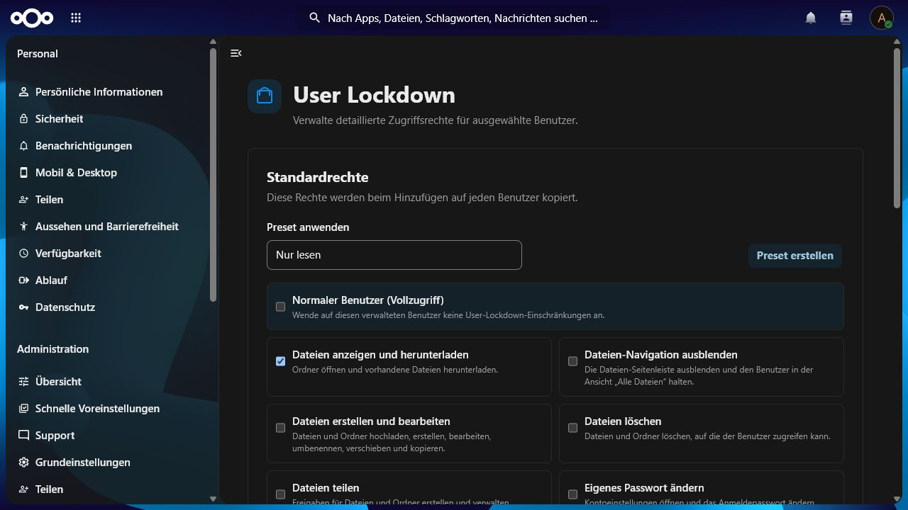
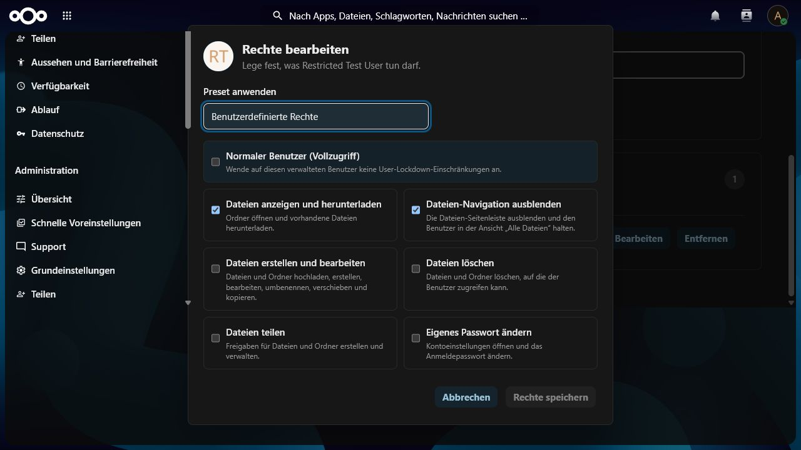
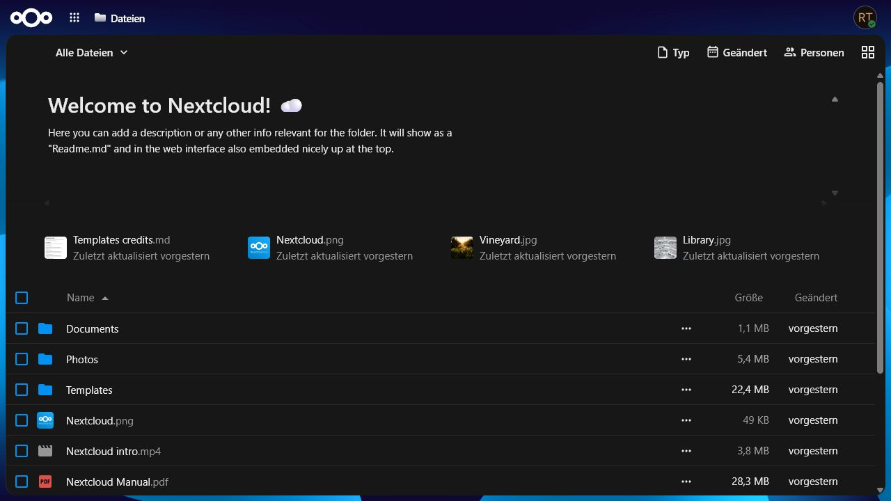
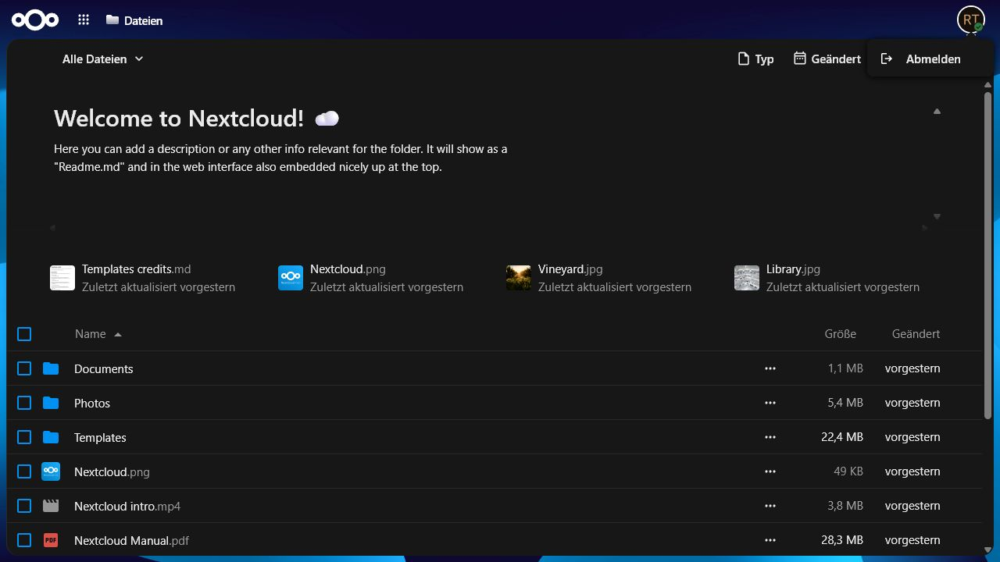

<p align="center">
  
</p>

<h1 align="center">User Lockdown</h1>

<p align="center">
  <strong>Server-enforced, granular access control for selected Nextcloud users.</strong>
</p>

<p align="center">
  <a href="https://github.com/RentnerKev/UserLockdown/actions/workflows/ci.yml"></a>
  
  
  <a href="LICENSE"></a>
</p>

User Lockdown is a Nextcloud security app for centrally managing what selected,
non-admin users may do. Administrators can independently allow file viewing,
writing, deletion, sharing, and password changes, or grant a managed user normal
full access. Reusable presets and configurable default permissions make recurring
policies quick to apply. An optional focused-files mode hides the Files sidebar
and keeps the account in **All files**.

Version 1.1.0 supports Nextcloud 32–34 and PHP 8.2–8.5. Existing users from
version 1.0.0 keep their previous read-only behavior after the update.

## See it in action

<table>
  <tr>
    <td width="50%" valign="top">
      
      <br>
      <strong>Defaults and presets</strong><br>
      <sub>Configure the permissions copied to new managed users and reuse recurring profiles.</sub>
    </td>
    <td width="50%" valign="top">
      
      <br>
      <strong>Per-user control</strong><br>
      <sub>Apply a preset or adjust every permission independently for one managed account.</sub>
    </td>
  </tr>
  <tr>
    <td width="50%" valign="top">
      
      <br>
      <strong>Focused Files view</strong><br>
      <sub>Optionally remove the sidebar and keep the user in All files while preserving the assigned capabilities.</sub>
    </td>
    <td width="50%" valign="top">
      
      <br>
      <strong>Minimal account menu</strong><br>
      <sub>Locked-down sessions expose only logout and, when allowed, the password settings.</sub>
    </td>
  </tr>
</table>

## Highlights

- Per-user permissions for viewing, writing, deleting, sharing, changing the
  account password, hiding the Files navigation, and normal full access.
- Built-in profiles for blocked, read-only, file editor, deletion-only,
  password-only, and normal users.
- Custom presets and configurable defaults. Presets are copied as snapshots, so
  editing one never changes existing users silently.
- Server-side enforcement across WebDAV, AppFramework controllers, shares,
  password actions, Text sessions, and file events.
- A capability-aware Files interface without recurring read-only notification
  noise.
- Deterministic, signed release archives with automated GitHub and Nextcloud App
  Store publishing.

## Permission model

| Permission | Allows |
| --- | --- |
| View and download files | Browse folders, preview files, and download existing content. |
| Create and edit files | Upload, create, edit, rename, move, and copy files and folders. Requires file viewing. |
| Delete files | Delete existing files and folders. Requires file viewing but not write access. |
| Share files | Create and manage shares. Requires file viewing. |
| Change own password | Open the personal security page and change the account password. |
| Hide Files navigation | Remove the Files sidebar and keep the user in **All files**. Requires file viewing. |
| Normal user (full access) | Bypass User Lockdown completely while keeping the user in the managed list. |

Turning off file viewing also turns off writing, deletion, sharing, and the
focused-files option. The focused-files option changes navigation, not the
underlying file permissions; direct links to other Files views return to **All
files**. A user without file viewing or password changes retains only a safe
shell for signing out. Removing a user from the managed list is different from
the **Normal user** preset: removal deletes the policy row, while the preset
keeps an explicit, reusable full-access assignment.

## Security boundary

The app enforces the assigned permissions server-side:

- WebDAV checks read, write, delete, destination, and overwrite operations on
  the authenticated user's Files and upload trees.
- File events provide a second enforcement layer for reads, writes, copies,
  renames, touches, and deletions.
- AppFramework access is limited to the Files surface, authentication, logout,
  and the explicitly allowed password and sharing actions.
- Share creation and management, password changes, and lost-password flows use
  their dedicated permissions.
- Administrators are never restricted, even if a stale database row exists.
- Full-access profiles bypass every User Lockdown guard.
- Deleting or recreating a user removes stale policy data for that user ID.

The Files UI removes unavailable controls and can hide its sidebar. Those visual
changes are usability aids; server-side DAV, middleware, and event guards are
the security controls. User Lockdown covers authenticated Nextcloud web and
WebDAV requests; CLI commands, background jobs, anonymous public-upload links,
and mutations performed entirely inside third-party code are outside this
boundary.

## Installation

Verify and extract the release archive so the final directory is
`custom_apps/user_lockdown`, then enable it:

```console
sha256sum -c user_lockdown.tar.gz.sha256
tar -xzf user_lockdown.tar.gz -C /path/to/nextcloud/custom_apps
cd /path/to/nextcloud
php occ app:enable user_lockdown
```

When running Nextcloud under a dedicated web-server account, execute `occ` as
that account. Never merge a new release into an old app directory because stale
files invalidate the integrity signature.

## Administration

Open **Administration settings → Security → User Lockdown**.

1. Configure the permissions new managed users should receive by default.
2. Optionally create custom presets for recurring roles.
3. Search for a non-admin user and select **Add**.
4. Use **Edit** in the managed-user table to apply a preset or change individual
   permissions.
5. Use **Remove** to delete the explicit policy and return the account to normal
   unmanaged behavior.

Permission changes apply on the user's next request. Updating or deleting a
preset does not modify users that previously received it.

## Local development

Requirements: Docker with Compose, Bun 1.2 or newer, and optionally Composer 2
plus PHP 8.2–8.5.

```console
bun install --frozen-lockfile
bun run build
docker compose up -d db redis mailpit nextcloud
docker compose run --rm bootstrap
```

Development endpoints and credentials:

| Service/account | URL or credentials |
| --- | --- |
| Nextcloud | `http://localhost:8080` |
| Administrator | `admin` / `admin-dev-password` |
| Restricted user | `restricted` / `restricted-dev-password` |
| Normal user | `normal` / `normal-dev-password` |
| Mailpit | `http://localhost:8025` |

These credentials are development-only and must never be used in production.

Run all checks with `make check`; use
`sh ./tests/integration/permission-profiles.sh` for the permission-profile integration suite
after the development stack has started.

## Release

`scripts/package.sh` and `scripts/package.ps1` build a deterministic release
containing only production files. The result is:

```text
build/user_lockdown.tar.gz
build/user_lockdown.tar.gz.sha256
```

The archive always has the required top-level `user_lockdown/` directory. App
Store releases are signed with the certificate issued for the `user_lockdown`
app ID.

For every update:

1. Increase the version in `appinfo/info.xml` and `package.json` to the same,
   higher semantic version. New backward-compatible functionality increments
   the minor version; fixes increment the patch version.
2. Commit and push the release-ready state.
3. Create a GitHub release for the matching `v<SemVer>` tag, such as `v1.1.1`,
   and press **Publish release**.

[`release.yml`](.github/workflows/release.yml) then runs the complete CI suite,
verifies the tag and version order, builds the app, signs every packaged file,
creates the deterministic archive and checksum, uploads both GitHub assets, and
publishes stable releases to the Nextcloud App Store. Only after that succeeds,
[`changelog.yml`](.github/workflows/changelog.yml) generates the Conventional
Commit release notes and applies the matching RentnerKev banner. GitHub
pre-releases receive a signed archive and development notes but are deliberately
not submitted as stable App Store releases.

The `release` GitHub environment must contain `APP_PRIVATE_KEY`,
`APP_PUBLIC_CRT`, and `APPSTORE_TOKEN`. The changelog workflow receives none of
these secrets. Reuse the same private key and certificate for every version;
the workflow creates a fresh file signature for each archive. Protect the
default branch and restrict release creation to trusted maintainers; the
workflow refuses to sign tags whose commit is not part of that branch. If one
trusted maintainer controls releases, required environment reviewers can remain
disabled for a literal one-click release. Otherwise, enable reviewers and accept
the deliberate approval step. GitHub's immutable releases must remain disabled
because the workflow attaches the signed artifacts and generated notes
immediately after publication.

## Project links

- [Source repository](https://github.com/RentnerKev/UserLockdown)
- [Issue tracker](https://github.com/RentnerKev/UserLockdown/issues)
- [Private security report](https://github.com/RentnerKev/UserLockdown/security/advisories/new)

## License

Copyright © 2026 Kevin Sträßler.

Licensed under the GNU Affero General Public License, version 3 or later
(`AGPL-3.0-or-later`). See [LICENSE](LICENSE).
